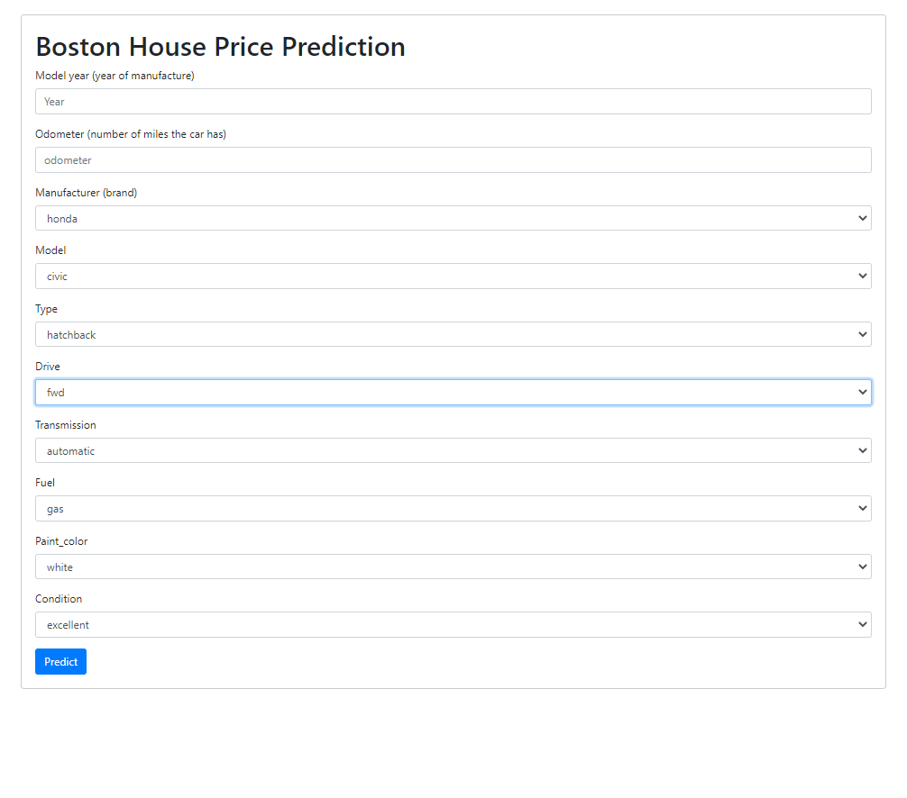

# Random Forest Model for Predicting Used Car Prices

This project includes data exploration, analysis, visualization and preprocessing, followed by training a random forest model on a used car dataset to predict car prices.
It also includes a simple web app.



## Libraries Used
- pandas
- numpy
- seaborn
- matplotlib
- sklearn

## Usage

In order to try this notebook you need to do the following steps:

1. Download (clone this repository) the notebook

## Usage
2. Create a python virtual environment
```
python -m venv <venv_name>
```

3. Activate the environment (different for each platform)
```
bash/zsh
$ source <venv>/bin/activate

fish
$ source <venv>/bin/activate.fish

csh/tcsh
$ source <venv>/bin/activate.csh

PowerShell
$ <venv>/bin/Activate.ps1

cmd.exe
C:\> <venv>\Scripts\activate.bat

PowerShell
PS C:\> <venv>\Scripts\Activate.ps1
```

4. Install the libraries in requirements.txt file using:

```
pip install -r requirements
```

5. Run the jupyter notebook and wait for it to finish

After this step you should see 2 new files in your directory. These are the pickled model and encoder which you will need to run the web app.
(I couldn't include the pickled files in the repository because of their size)

6. Run the app.py program in your terminal using (or something similar):

```
python app.py
```

7. The web app should be accessible in your browser as http://localhost:5000/

8. Fill the form with desired data and watch the magic happen !

## Dataset 

The dataset that was used for this project was downloaded from Kaggle: https://www.kaggle.com/datasets/austinreese/craigslist-carstrucks-data?datasetId=62920&sortBy=voteCount

It contains 400000+ instances with 26 features each (at the time of writing). Of the 26 features I used 12, the others were irrelevant for my goal.

## Strategies and methods used

### Data processing and cleaning
- Dropping irrelevant attributes
- Removing rows with missing (NaN) values
- Transforming some columns to better fit our model
- Merging categories of categorical attributes with least instance counts
- Removing outliers of numerical attributes
- Encoding categorical attributes with numberical values (one-hot encoding gave us too many columns and was thus too slow) 

I am still not sure which of these methods made the model work 100x better than it's previous version, I assume it was either categorical attribute merging, outlier removal or including some extra features.

### Data visualization
- Boxplots for categorical features
- Correlation heatmap for numerical features
- Scatter and hist jointplot for numerical features

### Model analysis
- Histplot
- Scatter plot

### Complimentary Web App
In order to make this model usable and easily testable i have created a simple web app (app.py), which presents you with a form that you can fill with your data and recieve a car price prediction based on the entered data

### Credits

This project was made with the help of the following projects:
https://github.com/krishnaik06/Car-Price-Prediction
https://www.kaggle.com/code/vbmokin/used-cars-price-prediction-by-15-models
https://www.kaggle.com/code/jominjae/used-car-price-prediction-lgb/notebook#NUMERICAL-DATA-VISUALIZATION
